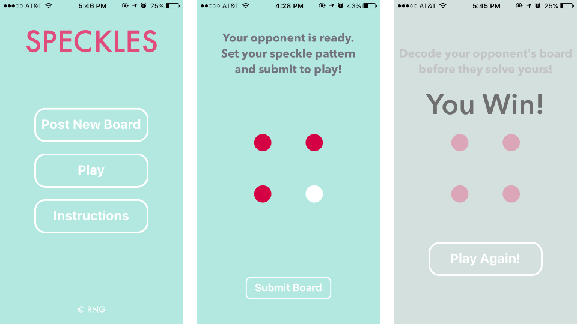

# Speckles

## Team Members
<a href="https://github.com/bbfrancis">Bernadette Masciocchi</a> | <a href="https://github.com/zlschatz">Zach Schatz</a> | <a href="https://github.com/SashaTlr">Sasha Tailor</a> | <a href="http://github.com/roytuesday">Pete Wood</a>

Speckles is a two-player game in which players select dots from a board in some order, and upon submitting a board and connecting with another player, race to guess the other player's board pattern. The fastest person wins.

The current iteration of the game runs on React Native, and uses a rails server with a JSON API. The server holds the board position information.

To run program in iOS:

In Terminal, run the following command to clone the repository to your computer:

  ```bash
  git clone https://github.com/nyc-island-foxes-2016/speckles.git
  ```

In a new terminal window, navigate to the '/speckles' directory and run:

  ```bash
  npm install
  ```

This will install all the React Native dependencies needed to run the Rails version of the app.

Navigate to 'rails-server' subdirectory and run commands

  ```bash
  bundle exec install
  rails server -b 0.0.0.0
  ```

In XCode, open file '/speckles/ios/OnTheDot.xcodeproj'.

Change all instances of 'localhost' in file to your computer's IP address:

* Open System Preferences -> Network
* Select the type of internet connection you're using: Wireless, Ethernet, etc.
* Your IP address will be four numbers separated by periods, E.G. 10.0.0.128

In XCode, select run simulation in iPhone 5 or 6, or connect iPhone to run to your device, and then select 'Build'. The simulator will launch an instance of the game on the simulator or your phone.

Screenshot of Speckles game in iOS with instructions:


<a href="https://trello.com/b/QN4KzHG3/icebreaker">Trello Board</a>
